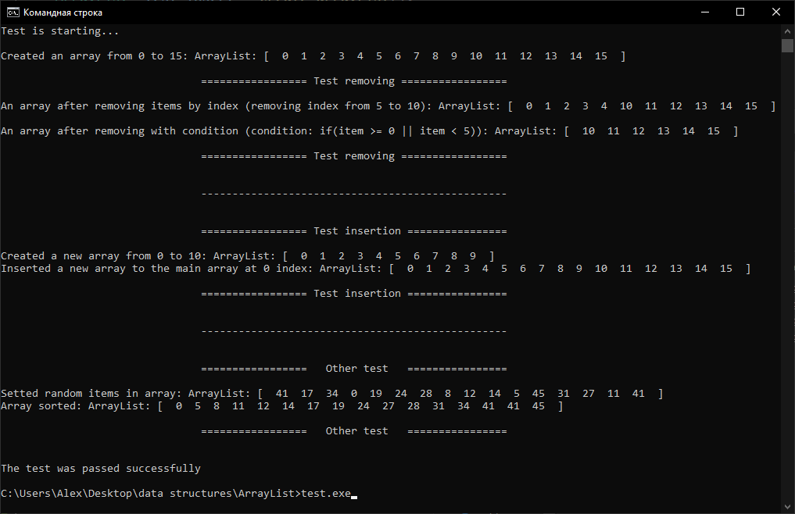
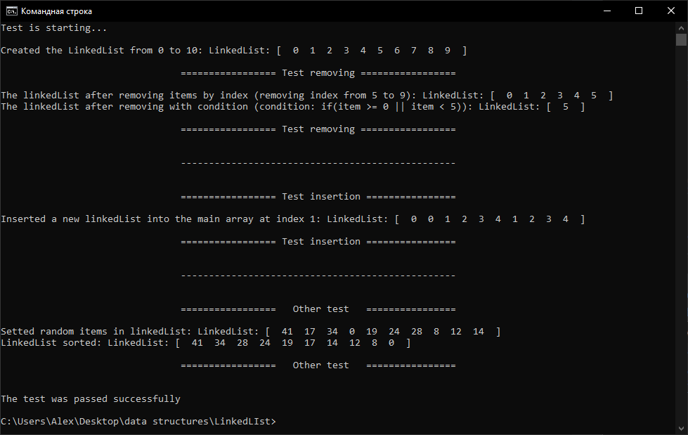
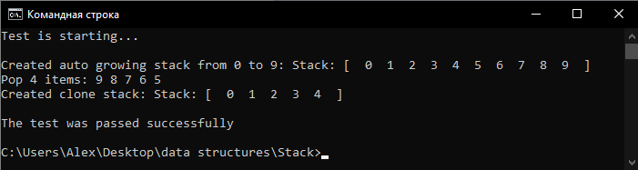
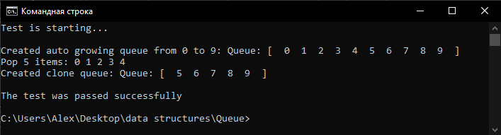
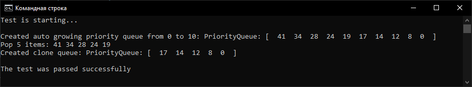

# data-structures  
It is a library of data structures. At the moment, the following structures are ready:
* List 
    * [ArrayList](https://github.com/ThePersonThat/data-structures/tree/master/ArrayList)
    * [LinkedList](https://github.com/ThePersonThat/data-structures/tree/master/LinkedLIst)
    * [Stack](https://github.com/ThePersonThat/data-structures/tree/master/Stack)
* Queue
    * [Queue](https://github.com/ThePersonThat/data-structures/tree/master/Queue)
    * [PriorityQeue](https://github.com/ThePersonThat/data-structures/tree/master/PriorityQueue)
## Testing 
* ArrayList: [source of test](https://github.com/ThePersonThat/data-structures/blob/master/ArrayList/test.c)   

* LinkedList: [source of test](https://github.com/ThePersonThat/data-structures/blob/master/LinkedLIst/test.c)

* Stack: [source of test](https://github.com/ThePersonThat/data-structures/blob/master/Stack/test.c)  

* Queue: [source of test](https://github.com/ThePersonThat/data-structures/blob/master/Queue/test.c)

* PriorityQueue: [source of test](https://github.com/ThePersonThat/data-structures/blob/master/PriorityQueue/test.c) 
